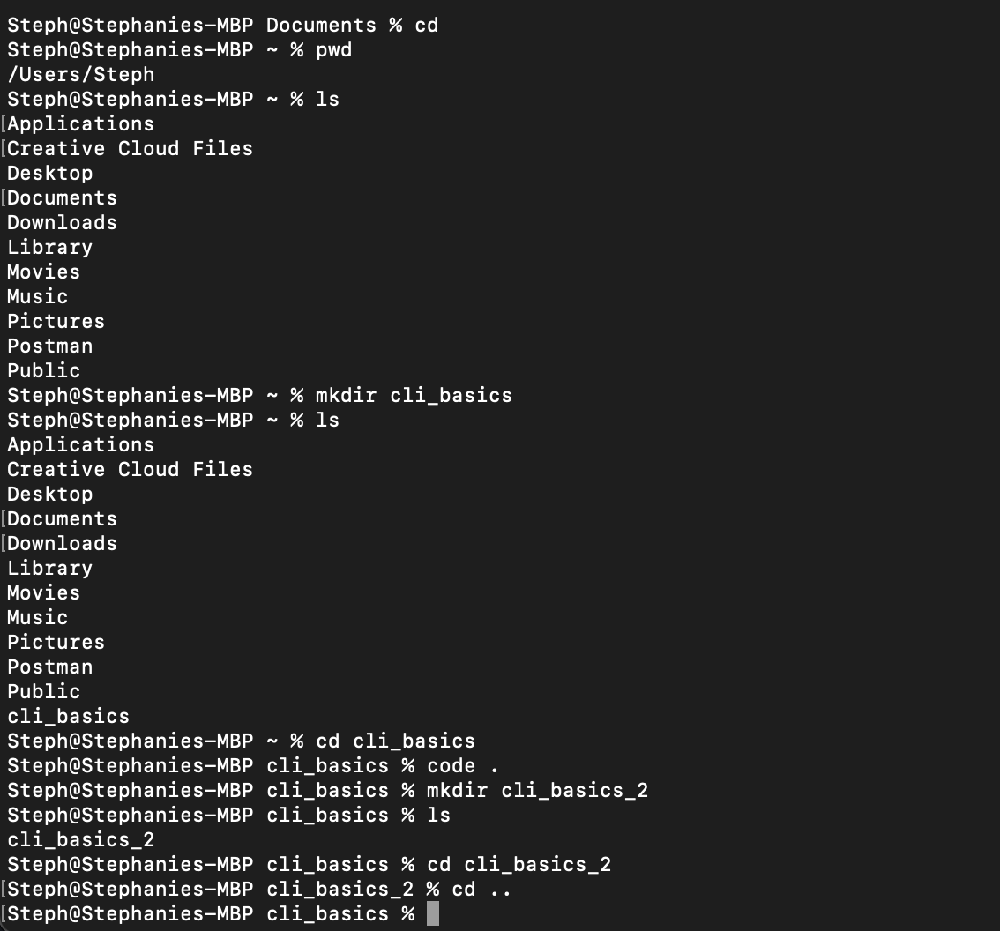

# Basic CLI Navigation Commands


##

## Description 📄

In this activity, we will explore basic CLI (Command-Line Interface) navigation commands that are essential for managing files and directories in a command-line environment. You’ll learn how to navigate to the home directory, check your current location, list directory contents, create directories, and open a directory in VS Code.

By the end of this exercise, you should feel confident using these basic CLI commands to navigate and manage your file system effectively.

## Expected Project Structure 🏗️

```plaintext
cli_basics/
└── No files needed
```

# Instructions ✅

## 1. **Open Your Terminal**
   - **Windows Users:** 
     - [ ] Open Git Bash on your computer. You can find it by searching for "Git Bash" in the Start menu. Git Bash provides a Linux-like terminal environment on Windows, which will be useful for this activity.
     
   - **macOS Users:**
     - [ ] Open the Terminal application. You can find it in `Applications > Utilities` or by searching for "Terminal" using Spotlight.

## 2. **Navigate to the Home Directory**
   - [ ] To ensure you're starting from the home directory, enter the following command in your terminal:

```bash
cd
```

**Explanation:**
- `cd` changes the current directory to your home directory.

## 3. **Check Your Current Directory**
   - [ ] Verify your current directory by using the `pwd` (print working directory) command:

```bash
pwd
```

**Explanation:**
- `pwd` displays the full path of the current directory, confirming your location in the file system.

## 4. **List the Contents of the Directory**
   - [ ] To view the files and directories in your current location, use the `ls` command:

```bash
ls
```

**Explanation:**
- `ls` lists all files and directories in the current directory.

## 5. **Create a New Directory**
   - [ ] Now, create a new directory named `cli_basics` using the `mkdir` command:

```bash
mkdir cli_basics
```

**Explanation:**
- `mkdir cli_basics` creates a new directory named `cli_basics` in your current location.

## 6. **List the Contents Again**
   - [ ] After creating the new directory, list the contents of the current directory again using the `ls` command:

```bash
ls
```

**Explanation:**
- Running `ls` again will now show the `cli_basics` directory that you just created.

## 7. **Navigate into the New Directory**
   - [ ] Change your working directory to the newly created `cli_basics` directory:

```bash
cd cli_basics
```

**Explanation:**
- `cd cli_basics` changes the current directory to `cli_basics`.

## 8. **Open the Directory in Visual Studio Code**
   - [ ] Open your `cli_basics` directory in Visual Studio Code by using the following command:

```bash
code .
```

**Explanation:**
- `code .` opens the current directory in Visual Studio Code. If VS Code is not installed, this command will not work, and you may need to install it or open the directory manually.

## 9. **Navigate to the Parent Directory**
   - [ ] After opening the file in Visual Studio Code, navigate to the parent directory using the following command:

```bash
cd ..
```

**Explanation:**
- `cd ..` changes the current directory to the parent directory of your current location.

##

**Great job! You’ve successfully navigated your file system and opened a directory in VS Code using CLI commands.**

# Conclusion 📄

In this activity, you learned how to perform basic navigation tasks in the command line using Git Bash on Windows and Terminal on macOS. These commands are fundamental for managing files and directories efficiently in a terminal environment. Mastering these will improve your workflow and prepare you for more advanced CLI operations in the future.

Remember to use your AI assistant to ask questions and troubleshoot issues.

---
© All rights reserved to ThriveDX
